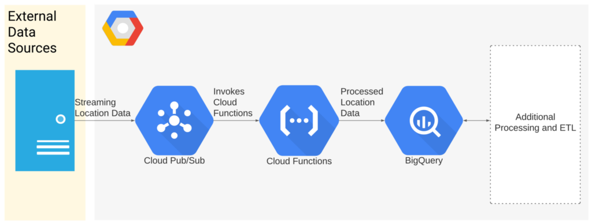

# BigQuery GIS - A Mobility Data Use Case
This repo implements the GCP geospatial data ingestion and processing part of the solution described in https://drvnintelligence.com/bigquery-gis-looker-a-mobility-data-use-case/" 

## 1. Ingesting shapefiles into bigquery
In order to draw map with FSA boundaries we need to ingest the geography datatype. 
1. find the .shp file of the Toronto FSAs(this can be found in [open data toronto](https://www.toronto.ca/city-government/data-research-maps/open-data/))
2. import geopandas and bigquery client
3. Create credentials in your application from the service account file. Mount the service key to create a service object with a bigquery client.
4. Create an empty table in BigQuery.
5. read the .shp file using geo pandas and upload geo dataframe to bigquery by specifying bigquery table name using bigquery client.

## 2. Simulate movement data and stream it to bigquery
There are two ways to ingest data to bigquery
Push the msg to PUBSUB in real time and use a cloud function to ingest the data from pubsub messages to bigquery with a push subscription.

## 3. Cloud function with Pubsub
This cloud function we run triggered by a pubsub topic. Every time there is a pubsub message append. It will load the event["data"] in json format, convert it to dataframe using pandas and append it to bigquery using bigquery client.

### Limitations
The message rate for this architecture is up to 20MB/s in large regions and 5MB/s in small regions, with the total size of data in each message being no larger than 10MB and each message having no more than 100 attributes.

Cloud Functions has a default internal memory of 256 MB, which can be extended to 4096 MBs during configuration, which in the current workflow will most likely not be exceeded given how Pub/Sub handles it's delivery rates per push request. 

CLoud function also has a 10 minute timeout which is definitely worth evaluating if we expect the Functions to include more complex data processing.

## Notebooks

### 1. movement_data_to_pubsub.ipynb
This notebook is identical with movement_data_to_pubsub.py. It defines migrating the user location data to google cloud pubsub.  
Using python osnmx packages that lets you download geospatial data from OpenStreetMap. Defined destinations locations for major areas in greater toronto region

For each user, the origin_node  and destination_node is calculated from osnmx packages, where we specify the user x and y coordinates which will return a tuple containing the distance between the coordinates and the nearest nodes. Calculated the shortest path between the origin_node and the destination_node and stored it in the route variable.

By using a publisher client from google cloud pub/sub defined project id and topic_name we fetched data from route variable and sent users latitude, longitude, and current time to google cloud pubsub for reference pub/sub-publishing.

### 2. movement_data_to_bigquery.ipynb
This notebook uses the same way to simulate the geospatial data as the first one. The only difference is that this notebook sends location data to bigquery directly with a sleep function.

